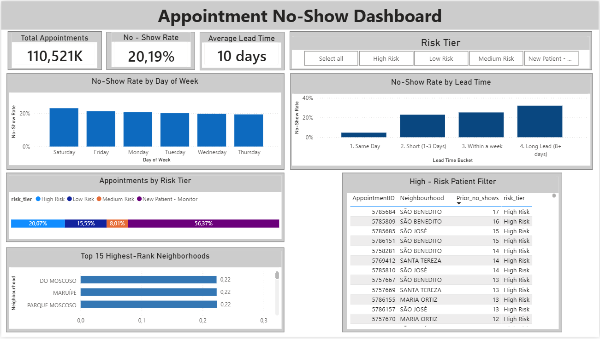

# Healthcare Appointment No-Show Analysis

SQL and Power BI analysis of healthcare appointment no-shows, identifying patterns associated with missed appointments and segmenting appointments by risk level.

---

## 📌 Project Overview

Patient no-shows can create operational challenges for healthcare organizations, affecting appointment availability, resource utilization, and scheduling efficiency.

This project analyzes medical appointment data to identify patterns associated with missed appointments and understand which appointment and patient characteristics are linked to higher no-show rates.

The analysis was performed using **MySQL for data cleaning and exploratory analysis** and **Power BI for data visualization and dashboard development**.

---

## 🎯 Business Problem

The main objective of this analysis is to understand patient no-show behavior and identify characteristics associated with a higher likelihood of missed appointments.

The analysis addresses the following questions:

- What is the overall no-show rate?
- Does the day of the week affect no-show rates?
- Does the time between scheduling and the appointment affect attendance?
- Do no-show rates vary across age groups?
- Are SMS reminders associated with different no-show rates?
- Which neighborhoods have higher no-show rates?
- Can previous patient behavior help identify higher-risk appointments?

---

## 📊 Dataset

The dataset contains medical appointment records with information about patients, appointments, reminders, health conditions, and location.

After data cleaning, the analysis included **110,519 appointments**.

### Main Variables

| Variable | Description |
|---|---|
| PatientId | Patient identifier |
| AppointmentID | Appointment identifier |
| Gender | Patient gender |
| Age | Patient age |
| Neighbourhood | Location associated with the appointment |
| Scholarship | Scholarship indicator |
| Hypertension | Hypertension indicator |
| Diabetes | Diabetes indicator |
| Disability_count | Disability count |
| SMS_received | Whether an SMS reminder was received |
| ScheduledDay | Date and time when the appointment was scheduled |
| AppointmentDay | Date of the appointment |
| No_show | Whether the patient missed the appointment |
| lead_time_days | Number of days between scheduling and the appointment |

---

## 🧹 Data Cleaning

Data preparation was performed using MySQL.

The main cleaning steps included:

- Standardizing column names
- Converting date fields into appropriate date formats
- Removing invalid age values
- Identifying and removing negative lead-time values
- Creating the `lead_time_days` variable
- Checking data distributions and inconsistencies
- Creating derived variables for exploratory analysis

---

## 🔎 Methodology

The analysis was conducted in several stages.

### 1. Data Cleaning

The raw dataset was imported into MySQL and prepared for analysis by standardizing fields, converting dates, removing invalid records, and creating derived variables.

### 2. Exploratory Data Analysis

SQL queries were used to calculate no-show rates across different dimensions:

- Day of the week
- Appointment lead time
- Age group
- SMS reminders
- Neighborhood

### 3. Patient History Analysis

SQL window functions were used to analyze previous appointment behavior for each patient, including:

- Number of prior appointments
- Number of prior no-shows

This allowed historical attendance behavior to be incorporated into the analysis.

### 4. Risk Segmentation

A **rule-based risk segmentation** was created using appointment lead time and previous no-show behavior.

Appointments were classified into:

- New Patient – Monitor
- Low Risk
- Medium Risk
- High Risk

This is a rule-based segmentation and **not a predictive machine learning model**.

### 5. Power BI Dashboard

The results were visualized in Power BI through KPI cards, charts, neighborhood rankings, risk segmentation, and a high-risk appointment view.

---

## 🔑 Key Findings

### 1. Overall No-Show Rate

The analysis included **110,519 appointments**, with an overall no-show rate of **20.19%**.

This means that approximately one in five scheduled appointments resulted in a missed appointment.

---

### 2. Longer Lead Times Are Associated with Higher No-Show Rates

No-show rates increased as the time between scheduling and the appointment became longer.

The highest no-show rate was observed among appointments scheduled **8 or more days in advance**, at approximately **32%**.

This was considerably higher than same-day appointments, which had a no-show rate of approximately **3%**.

This suggests that appointment lead time is an important factor associated with missed appointments.

---

### 3. No-Show Rates Vary by Day of the Week

No-show rates differed across appointment days.

**Saturday had the highest no-show rate**, at approximately **23%**, while **Thursday had the lowest**, at approximately **19%**.

This indicates that attendance patterns are not evenly distributed across the week.

---

### 4. Differences Across Neighborhoods

The analysis identified differences in no-show rates across neighborhoods.

The dashboard presents the **15 neighborhoods with the highest no-show rates**, considering only neighborhoods with at least **100 appointments**.

Among the neighborhoods displayed, **Santos Dumont** had the highest no-show rate, at approximately **29%**.

---

### 5. Patient History Provides Additional Risk Information

Previous appointment behavior was analyzed using SQL window functions.

Patients with a history of missed appointments can be distinguished from patients without previous attendance history, providing an additional dimension for appointment risk segmentation.

---

### 6. Risk Segmentation

The rule-based segmentation resulted in the following distribution:

| Risk Tier | Percentage |
|---|---:|
| New Patient – Monitor | 56.37% |
| High Risk | 20.08% |
| Low Risk | 15.53% |
| Medium Risk | 8.02% |

Approximately **20% of appointments were classified as High Risk** under the rules defined for this analysis.

This segmentation can help prioritize appointments that may require additional attention or follow-up.

---

### 7. SMS Reminders

The analysis identified differences in no-show rates between appointments where patients received an SMS reminder and those where they did not.

However, this analysis shows an **association rather than causation**. The results do not establish that receiving an SMS directly caused a change in attendance.

---

## 📊 Power BI Dashboard

The Power BI dashboard provides an interactive overview of appointment attendance patterns and risk segmentation.
It includes:
* Total appointments
* Overall no-show rate
* Average appointment lead time
* No-show rate by day of the week
* No-show rate by lead time
* Neighborhood ranking
* Risk tier breakdown
* High-risk appointment filtering



---

## 💡 Conclusion & Recommendations

The analysis shows that patient no-shows are not evenly distributed across appointments.

**Appointment lead time and previous patient behavior are particularly useful dimensions for identifying appointments associated with higher no-show risk.**

Based on the findings, healthcare organizations could consider:

- Prioritizing additional reminders for higher-risk appointments
- Paying particular attention to appointments scheduled well in advance
- Using previous attendance behavior when planning appointment follow-up
- Monitoring no-show patterns across different days and locations
- Using risk segmentation to prioritize follow-up efforts

A risk-based approach could help organizations allocate reminder and confirmation efforts more strategically.

---

## 🛠️ Tools

- **MySQL** — Data cleaning, transformation and analysis
- **SQL** — Exploratory analysis, window functions and risk segmentation
- **Power BI** — Data visualization and dashboard development
- **GitHub** — Project documentation and version control

---

## 📁 Project Structure

```text
healthcare-appointment-no-show-analysis/
│
├── README.md
│
├── sql/
│   ├── 01_data_cleaning.sql
│   ├── 02_exploratory_analysis.sql
│   └── 03_risk_analysis.sql
│
├── powerbi/
│   └── healthcare_no_show_dashboard.pbix
│
└── assets/
    └── dashboard_preview.png
